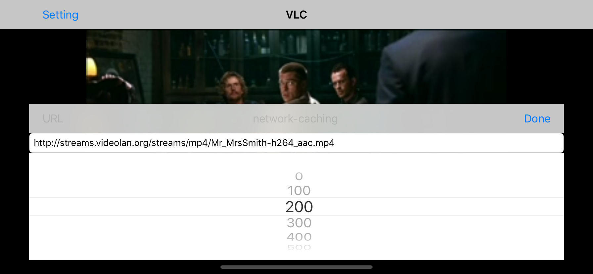

# VLC-iOS

## screenshot



[https://www.videolan.org/vlc/download-ios.html](https://www.videolan.org/vlc/download-ios.html)

## Binary

You can also get the binary from our servers instead of the App Store: `[VLC for iOS 3.1.5 binary](http://get.videolan.org/vlc-iOS/3.1.5/vlc-ios-3.1.5.ipa)`.
A binary version of MobileVLCKit is available through [CocoaPods](http://cocoapods.org/).

## 创建 VLC 项目

```sh
pod init
cat Podfile
# Uncomment the next line to define a global platform for your project
platform :ios, '9.0'

target 'VLC' do
  # Comment the next line if you don't want to use dynamic frameworks
  use_frameworks!

  # Pods for VLC
  pod 'MobileVLCKit'

end
```

### 更新 pod

```sh
pod repo update
```

### 安装 MobileVLCKit

```sh
pod install --verbose
```

### 下载实在太慢了

```sh
cat ~/.cocoapods/repos/master/Specs/b/f/7/MobileVLCKit/3.3.2/MobileVLCKit.podspec.json | grep http
...
     "http": "https://download.videolan.org/pub/cocoapods/prod/MobileVLCKit-3.3.2-e16829a-774a96ae6.tar.xz",
```

### 用 `Motrix` 下载上面的 MobileVLCKit-3.3.2-\*\*\*.tar.xz

## 更换 `http` 地址，进入下载好的地址

### 启动 Python3 Http Server

```sh
python3 -m http.server 80
```

### 更换 `http` 地址为本地地址

```diff
diff --git a/Specs/b/f/7/MobileVLCKit/3.3.2/MobileVLCKit.podspec.json b/Specs/b/f/7/MobileVLCKit/3.3.2/MobileVLCKit.podspec.json
index e6f4d118c5f..d3b15240c40 100644
--- a/Specs/b/f/7/MobileVLCKit/3.3.2/MobileVLCKit.podspec.json
+++ b/Specs/b/f/7/MobileVLCKit/3.3.2/MobileVLCKit.podspec.json
@@ -59,7 +59,7 @@
     "Benjamin Adolphi": "b.adolphi@gmail.com"
   },
   "source": {
-    "http": "https://download.videolan.org/pub/cocoapods/prod/MobileVLCKit-3.3.2-e16829a-774a96ae6.tar.xz",
+    "http": "http://127.0.0.1/MobileVLCKit-3.3.2-e16829a-774a96ae6.tar.xz",
     "sha256": "143877baa4e362b673c324d5319983a6023f9ed769c3b045fd49fd5efa53ec0c"
   },
   "ios": {
(END)
```

### 从新安装

```sh
pod install --verbose
```

终于安装成功了!

## 使用

### 添加 `Project-Bridge-Header.h` 头文件

这里的是 `VLC-Bridge-Header.h`

1. 添加 VLC-Bridge-Header.h -> "#import "MobileVLCKit/MobileVLCKit.h""
1. Build Settings -> Objective-C Bridging Header -> "VLC/VLC-Bridge-Header.h"

## 源码：[https://github.com/iOSDevLog/VLC-iOS](https://github.com/iOSDevLog/VLC-iOS)

## 微信公众号


## License

iOSDevLog.github.io is released under the MIT license. See LICENSE for details.
